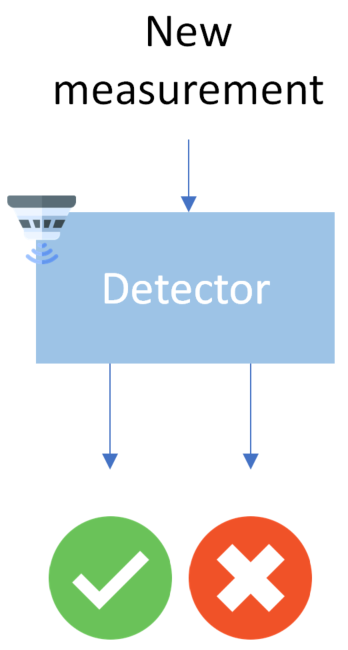

# Anomaly Detectors

  

---

### Detection methods

The two mainly used detection methods use different approaches:
* **Chi-Squared Detection**  
The objective of the **chi squared detection** method (also called
 *Mahalanobis distance* based detection) is to compare the new estimation
to a chi-squared distribution and see if it corresponds.   
This method helps ensure *consistency* as it takes in consideration *all previous measurements*. However, some insidious measurements can make
the distribution stay unchanged even though the estimation is off.

* **Euclidian distance Detection**  
The objective of the **euclidian distance detection** method is to
compare the *innovation* (difference between measured and estimated
state) to a threshold.  
This method helps ensure *coherence* but fails against a compromised
estimator and sensor.

---

### Examples of use

Examples of use are present within the source code, simply execute
the files `fdia_simulation/anomaly_detectors/chi_square.py` and
`fdia_simulation/anomaly_detectors/euclidian.py`
