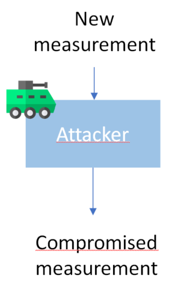

# Attackers

  

---

### Attacker models

The two attacker's models `AttackerModel` and `PeriodAttackerModel` have
the same objective over different types of measurements. The first one
attacks raws **measurements** as the other have to extract those
measurements from the **labeled measurements** they are stored in.

The attack uses the **attack matrix Gamma** and a **magnitude vector**
and modifies the measurement outputed by the attacled sensor as follows:

**New measurement = Old measurement + Gamma * Magnitude vector**

---

### Attacker types

Two attacker types are added as well:
* `DOSAttacker` / `DOSPeriodAttacker`:  
  The goal of this kind of attacker is to make any anomaly detector
  **discard** all measurements coming from the attacked sensor. Therefore,
  the *magnitude vector* consists of **immense values** for them to be **discarded** instantly.

* `DriftAttacker` / `DriftPeriodAttacker`:
 The goal of this kind of attacker is to add a constant **drift** to the
 position of the observed system along either **x,y,z or any combination**.

 * `CumulativeDriftAttacker` / `CumulativeDriftPeriodAttacker`:
  The goal of this kind of attacker is to add a cumulative **drift** to the
  position of the observed system along either **x,y,z or any combination**. This
  drift will be more efficient than the previous one as it will be considered
  correct by the filter and therefore the drift will be undetected and amplified.
