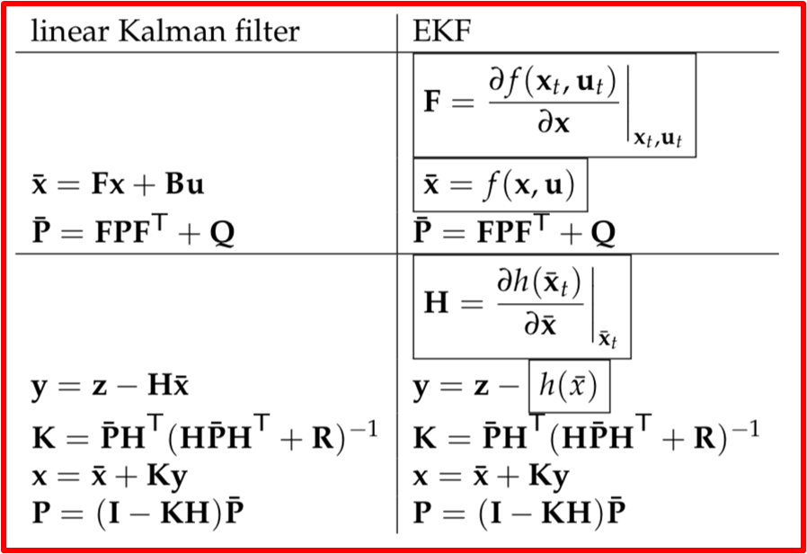
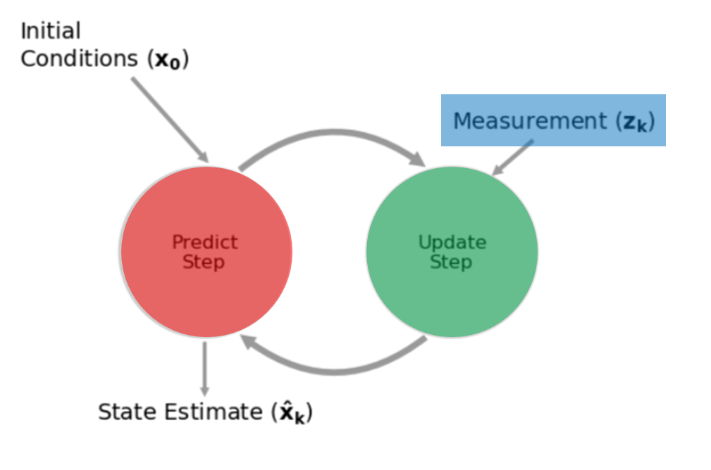

# Filters

---

### Extended Kalman Filter

The estimator used by Air Traffic Controllers to estimate the position
of airplanes approaching from the measurements made by different sensors
(Radars, ADSB, etc.).

---

### Models

*How to determine the state transition matrix F?*  

There is not a single good answer here and the actual way to determine a
fitting model for a trajectory is to test one of the following models:

  

* **Constant Acceleration:**  

* **Constant Velocity:**  

* **Constant Turn:**  

* **Thrust Acceleration:**  

Each model works well in certain cases but will mainly perform badly in
complicated cases or maneuvers.

---

### IMM
An **Interactive Multiple Models estimator** allows the estimator to
perform the predict/update cycle other a bank of filters and choose the
best fitting one to output the state estimation.

This choice is made by computing each filter's likelihood and take the most
likely.

---

### Sensor Fusion

*How to add a sensor to our system? Does it improve accuracy?*  

**Sensor fusion** allows us to combine different measurements into
a measurement vector and therefore take all available data into our
filter whether it is data itself or belief about a measurement.

(IMAGE NEEDED) H concatenation

---

### Different data rates

*What if sensors have different data rates, how to combine measurements now?*

We now need to store the **type of radar** the measurement comes from as
well as the **time** the measurement was taken at in addition to the actual
**measurement**.

We also need to recompute the **Q** and **F** matrix as they depend on the
**time unit** and this time unit is changed with each `update()` call.
The **H** matrix changes as well as measurement are coming from one radar
at a time and (nearly) never together.

(IMAGE NEEDED) LabeledMeasurement + H
