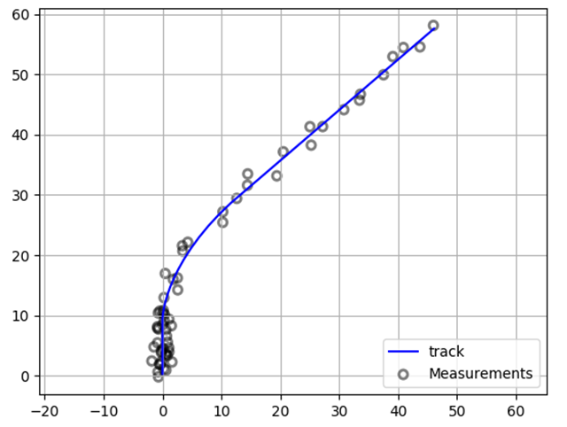
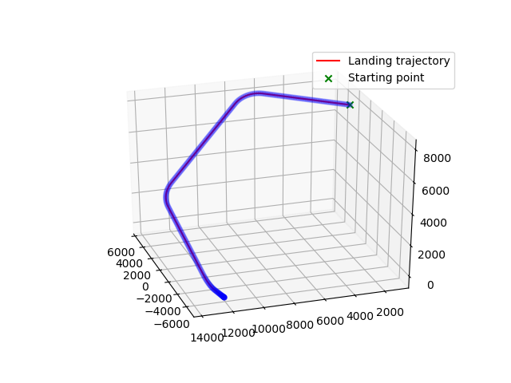

# Models

---

### Maneuvered system
A **maneuvered system** allows you to design a dydnamic system with
parameters that can be changed while processing the model. For
example, the *heading* or *velocity* could be parameters to be changed.
The change is made through the `Command` object that needs a specification
of the *new value* and the *number of steps* (number of calls to the
update model) in which the value should be reached.

---

### Sensors

The `NoisySensor` object allows to bring white noise into measurements.
His main goal is to change a **real value** into a **noisy value** as
follows:

**noisy value** = **real value** + `randn()` * **standard deviation**

### Radars

The `Radar` and `PeriodRadar` main objective is to convert positions
**x**,**y** and **z** into **range (r)**, **azimuth angle (theta)**
and **elevation angle (phi)**.

The `PeriodRadar` creates measurements with a **tag** refering the radar
it comes from, a **time** the measurement was taken (the time is noisy as
well) and the **measurement** itself.

---

### Tracks

The `Tracks` object implements several airplane trajectories to be used
more easily. They implement a step by step process resulting in a set of
system states.

---

### Examples of use

Examples of use are present within the source code, simply execute
the files `fdia_simulation/models/maneuvered_aircraft.py` and
`fdia_simulation/anomaly_detectors/maneuvered_bicycle.py` to have an example
of trajectory and use of the objects. The file `fdia_simulation/anomaly_detectors/tracks.py`
displays all implemented trajectories if executed.
